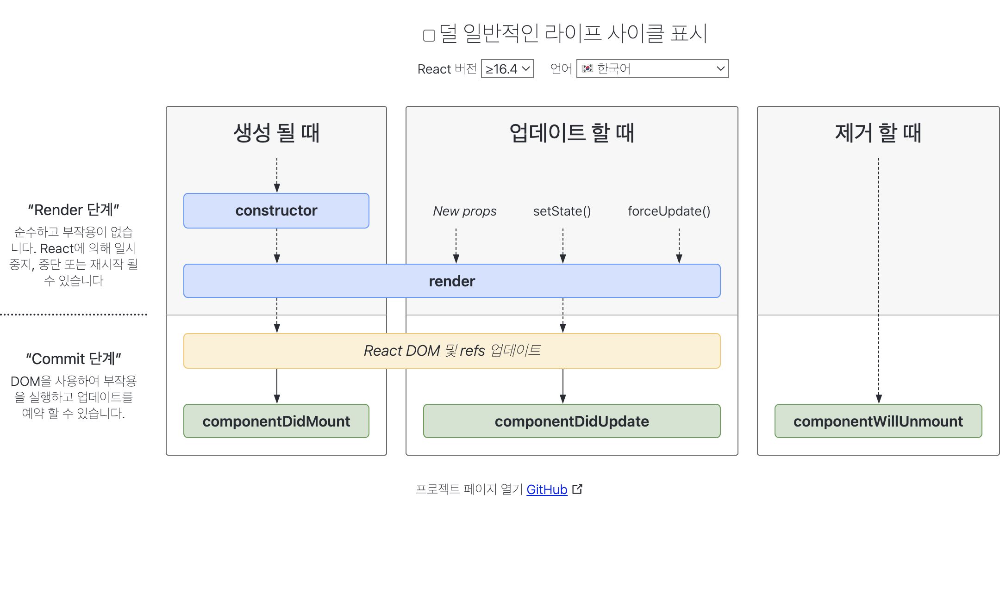

# 리액트에 대한 이해

### Javascript로 구현했을 때의 특징

- 상태에 따른 UI를 바꾸기 위해서 DOM 노드를 직접 조작해야 한다.
  - DOM 노드를 직접 조작하는 예시
  - `content.innerHTML = dataMap[key]`

### React로 구현했을 때의 특징

- UI 로직과 비즈니스 로직(데이터 - 상태값)을 분리 할 수 있다
  - 쉽게 말해서 이전 뷰를 날린 다음 결과적으로 보여줘야 하는 뷰를 다시 보여줍니다.
- 리액트는 내부적으로 Virtual DOM 이라는 것을 통해 변경된 부분만 업데이트 할 수 있게 합니다.
- 예시
  - Js에서 쓰였던 `content.innerHTML = dataMap[key]` 처럼 DOM을 직접 조작하는 부분이 없습니다.

```
import { useState } from "react";
import "./styles.css";

export default function App() {
  const [key, setKey] = useState("메일");
  const dataMap = {
    메일: "메일함을 확인하세요.",
    카페: "즐겨찾는 카페의 새 소식을 확인해보세요.",
    블로그: "오늘을 기록해보세요."
  };

  function clickTabItem(e) {
    setKey(e.target.id);
  }

  return (
    <div className="App">
      <div className="container">
        <div className="tab-items">
          <div className="tab-item" id="메일" onClick={clickTabItem}>
            메일
          </div>
          <div className="tab-item" id="카페" onClick={clickTabItem}>
            카페
          </div>
          <div className="tab-item" id="블로그" onClick={clickTabItem}>
            블로그
          </div>
        </div>
        <div className="tab-content-wrapper">{dataMap[key]}</div>
      </div>
    </div>
  );
}
```

### Babel

- Babel은 자바스크립트 컴파일러다. 입력은 자바스크립트 코드고 출력도 자바스크립트 코드다. 최신 버전의 자바스크립트 문법은 브라우저가 이해하지 못하기 때문에 babel이 브라우저가 이해할 수 있는 문법으로 변환해준다. ES6, ES7 등의 최신 문법을 사용해서 코딩을 할 수 있기 때문에 생산성이 향상된다.
- babel.config.js
  - `npx babel src/indexedDB.js --presets=@babel/preset-react`
  - 이와 같이 babel을 사용할 때 매번 이렇게 확인하면 번거롭기 때문에
  - babel.config.js 를 통해 설정을 해줍니다.
  - [참고링크](https://babeljs.io/docs/en/configuration)

### Webpack

- 바벨이 컴파일러라면 웹팩은 번들러이다.
  - 번들러 : 번들러(Bundler)는 분리된 JavaScript와 CSS 모듈 코드를 브라우저에 최적화된 여러 개의 파일로 결합합니다. React 애플리케이션에서 널리 사용되는 번들러에는 Webpack과 Browserify가 있습니다.

### HMR(Hot Module Replacement)

- Hot Module Replacement(또는 HMR)는 webpack에서 제공하는 가장 유용한 기능 중 하나입니다. 모든 종류의 모듈을 새로고침 할 필요 없이 런타임에 업데이트 할 수 있습니다.
- [참고링크](https://webpack.kr/guides/hot-module-replacement)

# JSX(리액트 기본 문법)

`const element = <h1>Hello, world!</h1>;`

위에 희한한 태그 문법은 문자열도, HTML도 아닙니다.

JSX라 하며 JavaScript를 확장한 문법입니다. UI가 어떻게 생겨야 하는지 설명하기 위해 React와 함께 사용할 것을 권장합니다. JSX라고 하면 템플릿 언어가 떠오를 수도 있지만, JavaScript의 모든 기능이 포함되어 있습니다.

> 경고
> JSX는 HTML보다는 JavaScript에 가깝기 때문에, React DOM은 HTML 어트리뷰트 이름 대신 camelCase 프로퍼티 명명 규칙을 사용합니다.
> 예를 들어, JSX에서 class는 className가 되고 tabindex는 tabIndex가 됩니다.

[참고링크](https://ko.reactjs.org/docs/introducing-jsx.html)

## 조건부 렌더링

- Return문 안에서는 조건문 사용이 불가능합니다.
- 그래서 사용하는 것이 삼항 연산자입니다.

[참고링크](https://ko.reactjs.org/docs/conditional-rendering.html)

## Components Props

https://ko.reactjs.org/docs/components-and-props.html

- props에서 아무 값도 넘기지 않으면 default로 true가 전달됩니다.

> props 간단활용예시

```jsx
function App() {
  const info = {
    firstName: "Chae",
    lastName: "Wonjin",
    withImg: true,
  };

  return (
    <div className="App">
      <Header title={"Learn React A"} />
      <Welcome {...info} />
    </div>
  );
}
```

## props.children 활용

- 사용자 정의 컴포넌트가 일반적인 html 태그의 구조와 비슷할 때
- 컴포넌트에 다른 컴포넌트를 전달해야 할 때

### JSX 참고 링크

https://ko.reactjs.org/docs/jsx-in-depth.html

---

## State

- 함수 컴포넌트는 함수다
- 함수 컴포넌트에서 내부적으로 상태를 관리해야 하는 일이 필요하다
- 리액트에서 사용하는 Hook 함수 중 useState
- useState 사용 예시

```ts
import React, { useState } from "react";
const [state, setState] = useState();
```

- setState() 는 컴포넌트의 re-rendering을 발생 시킨다.

### 원시 타입 state , 참조 타입 state

- 원시 타입 state 다루어 보기 : boolean, number, string
- 원시 타입은 이미 불변성을 지키고 있다

```ts
import React, { useState } from "react";

export default function Counter() {
  // 값, 값을 변경할 때 쓰는 함수
  const [count, setCount] = useState(0);
  const [show, setShow] = useState(true);

  const operators = ["+", "-", "*"];
  const [operator, setOperator] = useState(operators[0]);

  return (
    <div>
      <button
        onClick={() => {
          let result;
          if (operator === "+") result = count + 1;
          if (operator === "*") result = count * 1;
          if (operator === "-") result = count - 1;
          setCount(result);
        }}
      >
        {operator}1
      </button>
      <button onClick={() => setShow(!show)}>Show and Hide</button>
      <button
        onClick={() => {
          const idx = Math.floor(Math.random() * operators.length);
          setOperator(operators[idx]);
        }}
      >
        Change Operator
      </button>
      <br />
      {show && `Counter: ${count}`}
    </div>
  );
}
```

- 참조 타입 state 다루어보기 : object

```ts
import React, { useState } from "react";

export default function Counter() {
  // 값, 값을 변경할 때 쓰는 함수
  const operators = ["+", "-", "*"];

  const [info, setInfo] = useState({
    count: 0,
    show: true,
    operator: operators[0],
  });

  return (
    <div>
      <button
        onClick={() => {
          let result;
          if (info.operator === "+") result = info.count + 1;
          if (info.operator === "*") result = info.count * 1;
          if (info.operator === "-") result = info.count - 1;
          setInfo({ ...info, count: result });
        }}
      >
        {info.operator}1
      </button>
      <button
        onClick={() => {
          setInfo({ ...info, show: !info.show });
        }}
      >
        Show and Hide
      </button>
      <button
        onClick={() => {
          const idx = Math.floor(Math.random() * operators.length);
          setInfo({ ...info, operator: operators[idx] });
        }}
      >
        Change Operator
      </button>
      <br />
      {info.show && `Counter: ${info.count}`}
    </div>
  );
}
```

### State 심화

1. 직접 State를 수정하지 마세요
2. State 업데이트는 비동기적일 수도 있습니다.
3. State 업데이트는 병합됩니다.

- setState는 비동기적으로 실행되기때문에 비동기로 인해 발생하는 문제를 피하기위해서는 setState에 인자를 함수로 넘겨주면 됩니다

[참고링크](https://ko.reactjs.org/docs/state-and-lifecycle.html)

4. state 끌어올리기

- A라는 컴포넌트안에 동일레벨상에 B, C 라는 컴포넌트가 있다고 가정
- B에 있는 state를 C에서도 이용하고 싶을 때 A에 state를 올리는 것
- [참고링크](https://ko.reactjs.org/docs/lifting-state-up.html)

---

# LifeCycle, useEffect()

### Lifecycle



- componentDidMount : 실행 직후 한번만 실행
- componentDidUpdate : 업데이트될 때마다 실행
- componentWillUnmount : 제거될 때 한번 실행
- [관련링크](https://ko.reactjs.org/docs/react-component.html)

### useEffect

- Hook을 이용하여 기존 Class 바탕의 코드를 작성할 필요 없이 상태 값과 여러 React의 기능을 사용할 수 있습니다.
- Effect Hook, 즉 useEffect는 함수 컴포넌트 내에서 이런 side effects를 수행할 수 있게 해줍니다. React class의 componentDidMount 나 componentDidUpdate, componentWillUnmount와 같은 목적으로 제공되지만, 하나의 API로 통합된 것입니다.
- useEffect

```ts
import React, { useState, useEffect } from "react";

export default function App() {
  // 두 번째 인자 배열은 optional
  // 빈 배열을 사용하면 componentDidMount 처럼 동작
  // 빈 배열을 사용하지 않으면, ComponentDidMount + componentDidUpdate처럼 동작
  // 거의 대부분 빈 배열을 사용함
  useEffect(() => {}, []);

  // 배열에 인자가 있다면 특정 값이 변경 되었을때에만 해당하는 componentDidUpdate 처럼 동작
  // 배열을 의존성 배열이라고 합니다.
  useEffect(() => {}, [state, props.a]);

  useEffect(() => {
    return () => {
      cleanup;
    };
  }, [state, props.a]);
  // componentWillUnmount

  return <div>App</div>;
}
```

- [관련링크](https://ko.reactjs.org/docs/hooks-overview.html)
